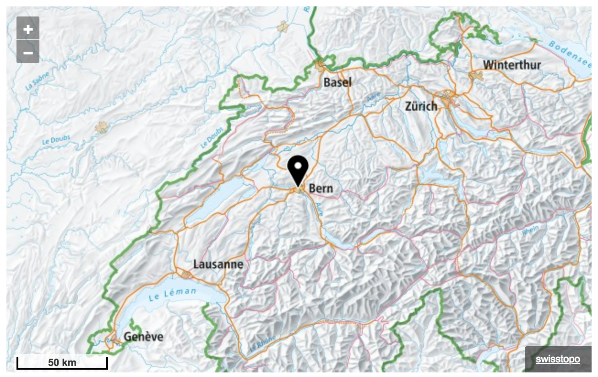
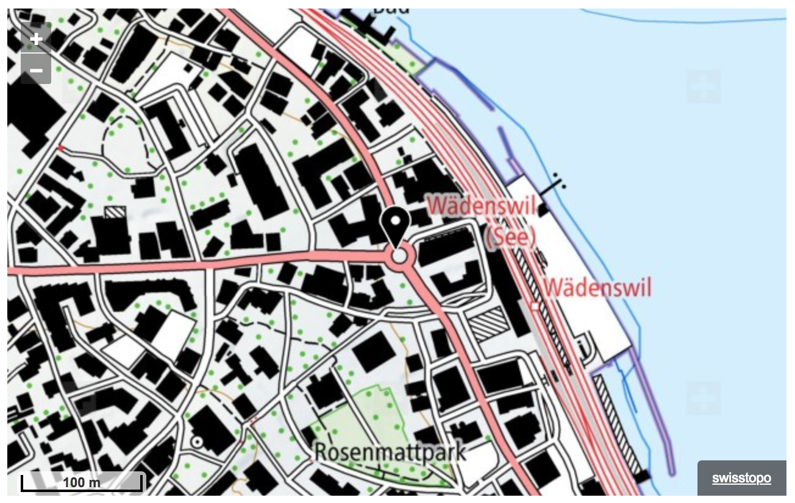
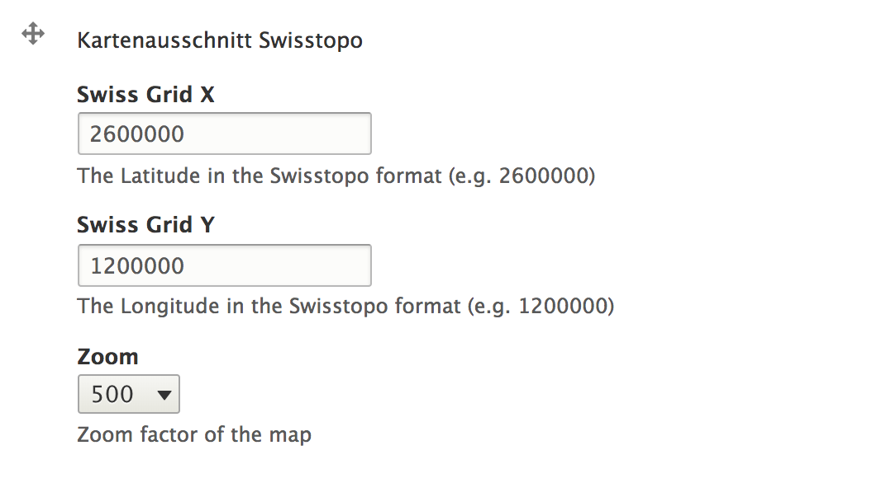

# Swisstopo Map Field

**swisstopo** module provides integration with the 
[Map of Switzerland](http://geo.map.admin.ch).

## Output

The module provides to add a mapbox with the swisstopo map.

Zoom 500 of Bern:


Zoom 1 of Wädenswil:


## Map-Field

The module provides a new field for setting the X- and Y-Coordinates in the
swissgrid format: `2 600 000 / 1 200 000`. Also you can choose the zoom-level
to define which zoom the mapbox will have.



## Installation

Since this module is not yet released on Drupal, we need to tell Composer
where to find it:

Add the following entry in the `repositories` section of your `composer.json`:

```
"swisstopo": {
    "type": "vcs",
    "url": "https://github.com/btemperli/swisstopo"
}
```

Now you can use the field `field_swisstopo` and add it to paragraphs, on pages,
wherever you want to use it.

## Configuration

You can choose between two Output-Settings

### Raw

Returns just the two Coordinates in the frontend.

### Rendered Map

Renders a map-box
 - Center at the coordinates
 - Marker at the coordinates
 - Zoom-level as entered in the field
 - Height: 400px
 - Width: 100%

---

#### Licence
The Map-Api of swisstopo is free to use for non-commercial projects.

**You have to register your website at
[admin.ch](https://www.geo.admin.ch/de/geo-services/geo-services/portrayal-services-web-mapping/programming-interface-api/order_form.html)
to use the API of swisstopo:**
[Registration](https://www.geo.admin.ch/de/geo-services/geo-services/portrayal-services-web-mapping/programming-interface-api/order_form.html)

This module is GPL-2.0+
